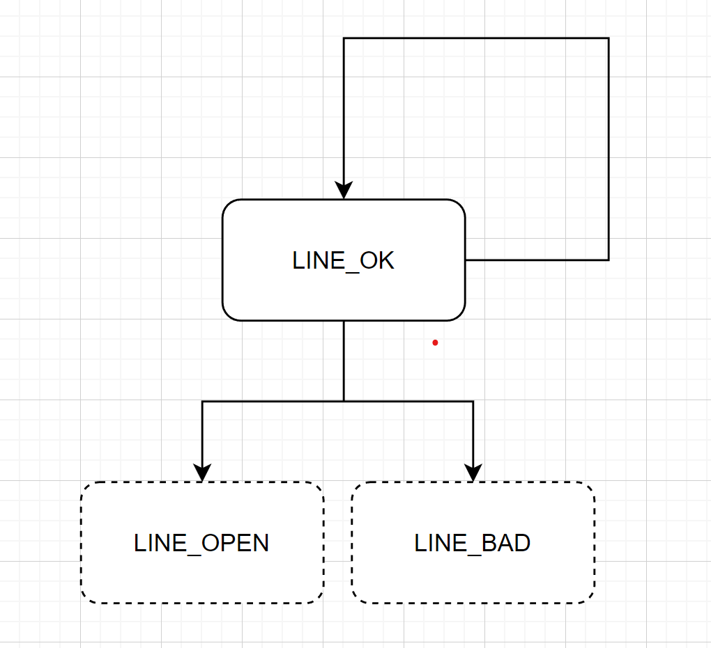
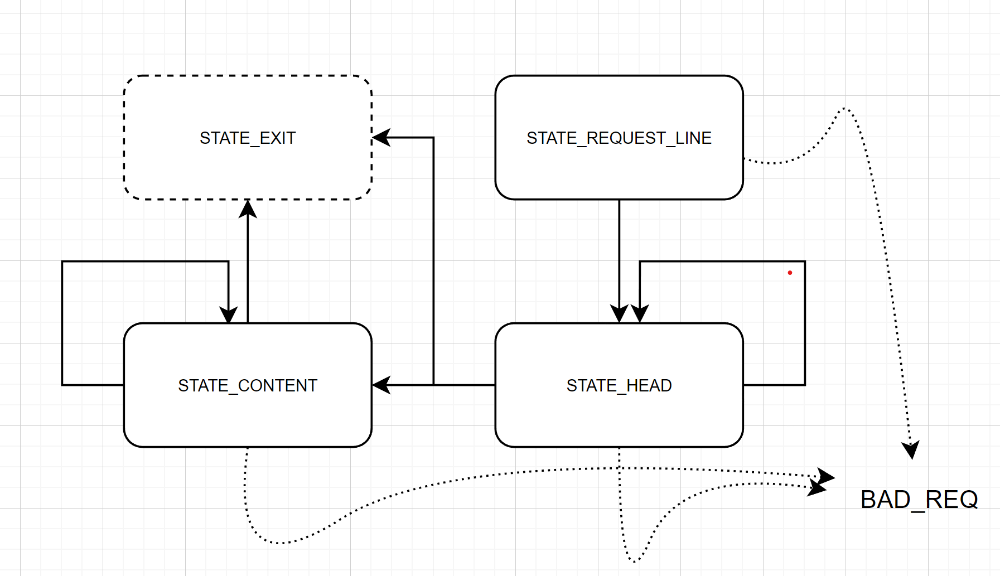
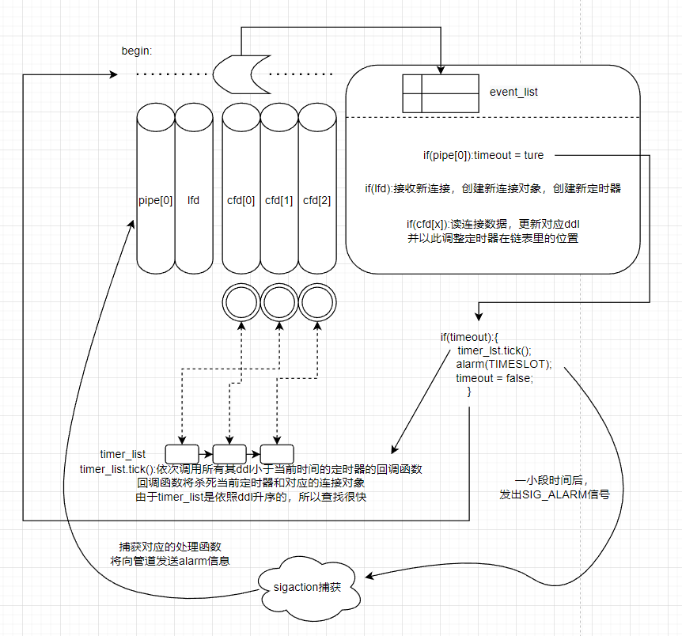
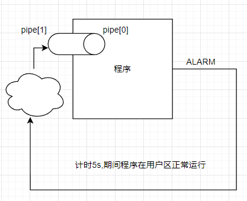
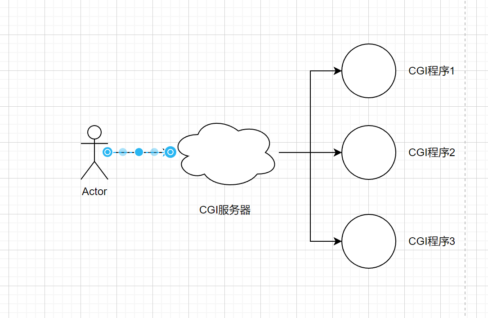

# 线程同步机制类

为了使得线程池在响应请求时，能够将请求信息视作临界资源。因此，需要为线程准备线程同步机制类，来使得线程池的操作是同步性的。

创建`./thread_pool/locker.h`，`./thread_pool/locker.cpp`。

该类文件简单封装了3个类，分别是互斥锁类、条件变量类、信号量类。每个类只是将原有c语言中对应函数族的初始化、销毁和基本操作进行简单封装。

# 线程池类

创建 `./thread_pool/threadPool.h` , `./thread_pool/threadPool.cpp`

依照书上代码，构建了线程池类，从代码层次理解了所谓的半同步/半反应堆的线程池模式。

线程池类既维护了一个请求队列，也维护了一个线程池。请求队列通过互斥锁保证了对请求队列的访问是互斥的，通过信号量来控制线程池中的线程执行队列中的某一请求。线程池在线程池类的构造函数中就完成了线程池的构建和初始化，其每个线程都将执行线程池类中的worker函数，而worker函数最终将使得线程去获得请求队列中的某一请求，如此确保了线程池的每个线程去独立执行不同请求的执行函数。

请求队列中是否有任务需要线程来执行依赖上面提到的请求队列信号量，在构造函数中，其信号量被初始化为0，只有当线程池类调用append函数追加一个任务时，才会调用信号量的post函数增加一个值，这确保了信号量的值和请求队列中任务的数量是一致的。而对于所有的线程，其执行的worker函数在逻辑的开始就设立了一个信号量的wait函数，使得，对于一开始没有任务，即信号量为0的请求队列，所有的线程都将睡眠等待。而当append()添加一个任务后，才会有一个线程被唤醒，从而去执行该任务。

由于既使用到了互斥锁来保证线程池中线程访问请求队列，又使用了信号量来调控线程池中线程是否需要访问请求队列，所以这一块逻辑还是有点迷糊，总觉得使用了信号量，是否还额外使用互斥锁来限制进程是否有些多余，也因此产生了对于代码中一些使用互斥锁的部分感觉可以去掉的想法。

# http连接类

该类的每个实例负责使得主机端可以维护一个连接socket，以成员变量的方式记录连接socket的文件描述符及地址。并以初始化成员方法进行维护的切换，针对该socket提供的主要api有：

1. 为该连接传输过来的，在proactor模式下异步存储到当前实例维护的读缓存内的，数据进行http解析
2. 分析该数据后，依照请求报文需求的路径准备相对应的当前主机端的资源，将其通过内存映射到工作线程内存中，并同时在对象维护的写缓存区内写入对应的响应报文头
3. 为工作线程提供工作函数api，该方法将会使得工作线程调用1.所指的解析函数，在解析该函数时，如果依据解析返回值发现请求报文不完整，则将epoll队列中该连接的监听事件再次调回读就绪并结束进程，期盼工作线程（在proactor模式下视作主线程）将读完剩下的请求报文并对当前连接所对应的连接类实例维护的读缓存进行补全。如果成功解析，则执行2.所指的响应函数，响应执行成功后，当前对象维护的写缓存和报文主体的内存已就绪，会将连接在epoll队列中的监听事件调至写就绪，期盼工作线程（主线程）以分散输出（writev）的方式将响应报文头和报文主体一齐搬到socket连接维护的TCP写缓存中并发送。
4. 为proactor模式下的主线程提供对象缓存的IO函数，当连接在epoll中监听到读就绪事件时，主线程将调用该连接类的读函数将TCP连接的读缓存中将数据一次性放入到连接实例维护的读缓存中；当连接在epoll中监听到写就绪事件时，主线程将调用该连接类的写函数将TCP连接的写缓存中将数据一次性放入到连接实例维护的写缓存中。

由于尽管4.提到的IO函数是该类的成员函数，但这是由于本项目是一种模拟proactor模式，即在规则上，其是由主线程进行调用执行，因此此处关于4.部分的内容讲解将转移到主函数中的开发文档中统一讲解。

## 解析函数

本项目目前实现的对请求报文的解析暂时只支持http协议。

关于解析报文的核心逻辑：

- 由于http协议下的请求报文由许多行组成，因此，对请求报文的解析应该以一行为一个基本单位。
- 每一行的**检查逻辑**将产生3类检查结果中的某一个，检查成功或检查不完整或检查语法错误，后两者都将导致函数的提前结束，而前者使得一个前提为行正确的解析逻辑得以运行。
- **解析逻辑**如下：在确保当前行是正确的情况下，将会对行的内容进行解析，具体如何解析当前行将由当前的解析状态决定，而之后当前行所处的解析状态以及当前行的解析结果将决定解析状态会切换到何种状态。解析的结果将返回解析成功、解析完毕和解析失败。对于解析失败的返回值，则当前函数也将提前结束。解析完毕将使得解析状态直接跳到出口状态，则会使得解析函数的逻辑执行完毕并紧接着调用一段依据解析结果进行处理的**处理逻辑**。解析成功将会使得逻辑继续处理下一行并同时切换解析状态/保持。

从上面的逻辑我们可以看出有两组状态需要同时注意，其中检查状态的成功状态是后面开始执行解析状态的前提。项目在此使用两个状态机，即主从**状态机**分别同时运作这两组状态，确保逻辑的正确运行。

### 有限状态机

有限状态机负责进行状态的转移以及确保函数在不同的状态下正确的运作。本项目的主状态机只有在 从状态机 处于LINE_OK状态下，才能正常运作。我们先将两个状态机拆分独立来看而不在乎之间依赖的关系的话，那么状态机的伪码大抵如下：

```c
//从状态机
STATE_MACHINE(){
	State curState = LINE_OK;
	while(curState == LINE_OK){
        Package pack = getNewPack();
		switch(curState){
			//只有一个状态
			case LINE_OK:
				curState = process_state_ok(pack);
				break;
		}
	}
    //标识句子不完整，还需继续读
	if(curState == LINE_OPEN){
		process_state_open();
        return;
	}
    //标识句子语法错误
	if(curState == LINE_BAD){
		process_state_bad();
		return;
	}
}
```



```c
//主状态机
STATE_MACHINE(){
    State curState = CHECK_STATE_REQUESTLINE;
    int ret;
    while(curState != CHECK_STATE_EXIT){
        Package pack = getNewPack();
        switch(curState){
            case CHECK_STATE_REQUESTLINE:
                ret = process_requestline(pack);
                if(处理过程出错){
                    //结束
                    return;
                }
                //由于请求行只有一行，则请求行状态执行完必定切换到请求首部状态
                curState = CHECK_STATE_HEAD;
                break;
            case CHECK_STATE_HEAD:
                ret = process_head(pack);
                if(处理过程出错){
					return;
                }
                if(遇到空行 && 剩余内容为空){
                    curState = CHECK_STATE_EXIT;
                }
                if(遇到空行 && 剩余内容不为空){
                    curState = CHECK_STATE_CONTENT;
                }
                //常规情况下，状态不会改变
                break;
            case CHECK_STATE_CONTENT:
                ret = process_content(pack);
                if(处理过程出错){
                    return;
                }
                if(读完){
                    curState = CHECK_STATE_EXIT;
                }
                /*
                常规情况下，状态不会改变；但是项目使用的逻辑是对于请求体不再以行为单位，而是一口气读完，
                如果读的时候发现读的长度不够在请求首部中指定的请求体长度，则说明读的内容不完整，则将结束函数，
                期待主线程之后对报文内容补齐。
                但此处为了方便理解可以先不想这么复杂，就当做逐行读请求体，如果没有出现读完标志，则状态不变的一般性逻辑理解。
                */
                break;
        }
    }
    //报文解析成功，执行处理请求逻辑
    if(curState == CHECK_STATE_EXIT){
        doRequest();
    }
}
```



### 检查逻辑

对于逐行的检查，需要引入2个指针来说明对读缓存中的数据操作，分别是readed指针表示当前读缓存中有效的数据尾部，checked指针表示当前读缓存中正检查到的字符。

对于http中每行的结尾都是以`'/r''/n'`两个字符作为标志，则我们从检查指针向后遍历检查，如果碰见了`'/r''/n'`代表检查成功一行。如果碰见了`'/r''/n'`其中之一，当只出现`'/r'`且下一位就是readed指针所指的位置，代表数据不完整，此时会返回检查不完整，此外都将返回检查错误。当未碰见`'/r''/n'`，而检查指针走到了readed指针所指位置，也代表不完整，会返回检查不完整。

### 解析逻辑

解析逻辑是一组逻辑：解析请求行，解析请求首部，解析请求体，对于不同的解析状态，将会有不同的解析行的逻辑函数。

对于请求行：

- 项目使用了strpbrk（查找指定字符的在字符串中的首位，用来查空格）和strspn（查找除指定字符外的字符串中其他字符首位，用来跳过空格）,来对请求行的一行字符串进行拆解，由于http报文的请求报文的请求行遵循一定规范，因此对拆出来的各个子字符串，直接依照规范排布的顺序进行识别即可。
- 本项目仅支持一种同时也是较为通用的请求行规范：method / url / http_version，故代码上即将请求行拆为三段，依此识别记录。

对于请求首部：

- 对于http请求首部都是遵循 首部字段名：说明的规范，因此使用 strncasecmp函数对当前行的前几位字符和字段名进行匹配，对于匹配到的字段名，将说明的内容存储在对象提前设立的成员变量形式的首部字段成员中即可。
- 本项目支持识别的首部字段名：
  - Connection
  - Content-Length
  - Host
- 不识别的首部字段，将跳过并在终端输出信息。
- 当发现当前行字符串为空字符时，代表碰见了空行，如果依据解析的Content-Length结果不为0，代表还要解析请求体，则将解析状态切换到请求体，否则，代表解析完毕，将解析状态切换到exit状态

对于请求体：

- 不再以行作为单位，直接一口气读入剩余数据。
- 本项目还未实装解析请求体的操作，因此解析请求体不会得到任何信息，除了得到返回值的信息，即当前请求体是否正确结束或者不完整。

### 处理逻辑

处理逻辑将依据解析逻辑解析记录的各种值进行操作。

本项目目前只实装使用GET方法请求服务器传输目标资源的操作。由于解析逻辑已经解析出了请求的目标资源的相对路径，将在检测目标资源的访问权限和是否正确之后以只读的方式打开服务器上的资源，并将该资源以内存映射的方式搬运到线程内存中。

## 响应函数

相较于解析函数，响应函数的逻辑比较简单。

首先，它接收从解析函数的返回值，依照返回值来依照  http响应报文规范 生成响应报文

如果返回值是错误信号，则将各种解析函数的错误信号处理成http响应行要求的对应的编码，同时写好对应的响应首部和响应体。

如果返回值是正确信号，则返回服务成功的编码的响应行，并同时写好对应的响应首部，而由于正确的响应体已经由内存映射的方式进入了内存并不用再生成，此处只需使用预先定义好的成员变量地址数组，将写了响应行和响应首部的写缓存地址和 实际是响应体的内存地址记录起来，待到主线程来进行分散写出到TCP写缓存中即可。

## 工作线程API

该API负责由工作线程调用，目前的逻辑细节已经在前文中说的很清楚了。此处仅是占位。

# 主函数

主函数主要逻辑：

- 创建线程池

- 创建连接对象数组

- 建立监听socket，为了使得监听socket的连接能快速的断开和重建，将监听socket设置为端口复用。

- 创建epoll对象，首要先将监听socket放入epoll监听队列中。使用永久性循环不断检测带有阻塞性质的epoll_wait函数。当epoll失败时，循环将结束。epoll监听成功时，将使用遍历就绪事件的方式，逐个处理每个就绪事件。

  - 当就绪事件的连接号显示为监听socket时，说明监听socket听到新内容，也就是有客户端申请连接。则通过accept函数，将接受连接并返回新的socket连接号，用于和对应的客户端进行一对一通信。此时会以该通信连接号为下标，在连接对象数组中对应的对象进行初始化，初始化的参数就是该连接号和客户的地址，而初始化的动作又会将该通信连接载入到epoll监听队列中并设置为oneShot模式，来使得epoll队列的快速迭代。这样待到通信连接中的接受消息就绪时，就会被epoll检测到。
  - 当就绪事件的连接号不为监听socket，且为读就绪，那么主线程将调用与连接号对应的连接类对象的IO函数，一口气将连接socket的TCP读缓冲区的数据读入到连接类对象的读缓存中，之所以要一口气，是因为上文讲了为了epoll队列的快速迭代，epoll事件设置为oneshot只会通知一次，因为对于一次就绪只会收到一次信号，所以就要一口气读完所有的就绪缓存，且由于可能需要读多次，我们在上文的初始化过程中，还将该连接使用`setNoBlocking()`设置为非阻塞，从而利用死循环不断读取，仅当读取出现了表示无内容可读的errno == EAGAIN/EWOULDBLOCK时，才会跳出循环，结束读进程。在这一步成功进行后，我们通过读取函数成功将TCP连接的读缓存全部读到了连接对象维护的读缓存中，在此基础上，我们才将该对象发往线程池的任务队列中，这体现了proactor的框架模式。而线程池中的任务队列获取到了任务后，会调动空闲线程执行任务对象的对应函数，详情参考线程池类。
  - 当就绪事件的连接号不为监听socket，且为写就绪，那么主线程将调用与连接号对应的连接类的IO函数，一口气的将连接对象的待写内容发送出去，这个过程也使用了死循环，只有当写函数告知写失败或者彻底写完数据才会跳出循环，而前者的写失败如果是因为TCP写缓存不够，则会将该连接再次放入到epoll的写就绪事件中，离开循环，完成本轮事件，这样等到主线程下次再检测epoll时，又会再次进行该连接对象的写操作，继续陷入循环。成功写完后，将通过检查解析报文的要求是否需要持续的连接，如果要求是，则连接对象除了绑定的连接号和链接地址，其余成员变量重置，并等待下一轮的报文往返；如果要求否，则连接关闭。


# 定时器类

在之前的基础上补充定时器类，用于定期关闭长时间不活跃的连接。

虽然说叫定时器类，但从理解的视角上，使用DDL类（ddl：deadline,到期时间）的名称去理解似乎更加容易。

定时器类文件listTimer中实际实现了两个类，一个即是定时器类,一个是用于管理定时器类，定期对定时器类中时间过期的定时器类进行操作的sort_timer_list类（链表类）.

定时器中维护一个时间成员和一个指针指向服务对象（在本项目中服务的是连接对象），时间成员记录的是服务对象的到期时间，其数值等于服务对象最近一次活跃的时间加上一段固定时间。为了能让被服务的对象知道服务自己的定时器，在本项目中为被服务的对象，即连接类增加了一个成员指针用于指向一个定时器，如此，每次连接类中进行活跃或者关闭连接操作时，将可以利用该连接类中的定时器指针找到和该连接类绑定的定时器，从而对定时器进行更新或删除。

为了方便对一群定时器进行维护，一个方法是将定时器连接成一个链表，因此要将定时器变为链表的结点，故而在定时器对象中加上前后指针。同时使用链表类对这个链表进行管理，链表类维护该链表的头尾指针，并提供加入节点和删除节点的函数。由于任务是定期对定时器链表进行检查，关闭那些已经到达到期时间的定时器已经这些定时器指向的连接类中的连接，出于效率的考量，我们使得这个链表是有序的，即链表上的定时器结点依照到期时间排序，如此，我们每次检查只用从头开始检查，当检查到某一节点的到期时间还未到期时，则说明之后的所有节点都为到期，那么可以提前结束检查，因此加入节点的函数中要引入排序插入的操作，同时还提供调整函数，使得一些定时器的到期时间在修改后，需要重新在链表上被调整到合理位置。在完成了增加和调整函数确保有序性之后，就可以添加检查函数，在这里我们特别的对定时器链表的检查叫tick(),代表时钟滴答跳了一次。

当定时器到期后，在链表中被tick()函数检查出来后，由于我们的目标是，关闭不活跃连接，代表定时器到期后需要做的事件就是关闭连接，则我们需要通过定时器去调用连接对象的关闭连接操作，在完成后，定时器的使命结束，则在tick函数中也应该将这些过期的定时器使用删除节点的函数删除掉。

为了让整个进程具备定期检查 的能力，也即定期调用timerlist的tick()函数，我们需要一套能脱离进程本身的定期机制。参考书上使用的是信号进制，即在进程开始时，发出一个延时信号，一个时间周期即将结束时，信号会到时发送，有提前注册的信号捕获函数捕获并执行处理，处理的逻辑即是向进程通过管道发送一条消息。而由于我们的进程会处于持续监听事件的过程中，我们提前将管道出口注册到监听队列中，则进程会立马收到管道消息，在收到消息后，如果消息代表的是alarm，则我们在当前轮次的监听事件处理完之后，知道一个时间周期结束，则调用tick()函数，来完成对定时器链表的定期检查，并立马再发送一个延时信号，该信号会在下一个时间周期快结束时发送，再通过-信号捕获-管道-监听通知到进程中，让进程在下一个时间周期快结束时，执行定期检查和发送延时信号的逻辑。

下图为参考项目代码实现的框架示意，细节部分来源于代码的实现，但总体的运作模式其实就是上面一段话概括的：



强调信号转化关系的简图：




## 定时器融入到之前版本代码的实现问题

tinywebserver的实现方式:

- 在time头文件中额外定义timer的client_data类（姑且称之为定时器server类）。其结构记录了server对象连接的sockfd和地址，同时记录该对象对应的timer类指针
- 在main函数中创建多少个客户连接类的数组，就创建多少个客户定时server类的数组。
- main函数中在接受到新连接时，根据连接的fd号作为下标在两个数组中各找到一个对象 为其服务：
  - 连接类调用自己的成员函数init，将其连接类的sockfd和地址记录为新连接的fd和地址。
  - 定时server类，将其server类的sockfd和地址记录为新连接的fd和地址。同时创建timer，经timer的作用对象指向该server类，而该server类的timer指针也反向指回该timer。timer对象被放入timerlist管理
- 当某一连接发生IO事件时，通过该连接对应的server类找到对应的timer，修改timer的ddl时间后，再使用timerlist的调整函数进行调整
- 如果期间有IO错误或别的事件，导致需要关闭连接：
  - 则首先根据该连接找到server类中的timer,调用timer承载的回调函数，该回调函数将实际去除epoll事件，关闭连接（抢了连接类做的事）。
  - 其次再调用timerlist的删除函数，该函数会将timer对象释放。（此时server类中的timer指针危险）
- 连接类在正常写完，由于请求报文的要求持续连接，但是需要重置空间时，重置了内部空间。定时器未被重置，定时器在稍后会被赋予新的时间，继续使用。

小结tinyserver的实现方式，定时器server类和连接类都是一样长久存在，期间有新连接出现，则创建新的timer放在server类中，一如得到新的sockfd连接号放在连接类中。如果正常写完报文且需要持续连接，需要重置连接类的空间，但是连接类的sockfd连接号不在此中。而server类的定时器也不会被重置（删除），只是更新时间做调整。如果连接断开，连接类仅仅是去除事件和关闭连接，没有重置空间（留待下一次初始化被重新赋值），而server类的定时器也仅仅是释放连接类，但server类的指针并没有被重置（留待下一次初始化被重新赋值）。

基于上面的总结实现，我们可以将server类并入连接类，如此，可以去除对sockfd存储了两次，虽然这样将导致连接类和server产生紧耦合。但使得合并的具体操作就是在连接类中多加一个timer指针。

在一开始申请一个连接类数组，当新连接出现时找到数组中对应的连接类，创建新的timer类和sockfd一样被初始化到连接类中。期间正常写完且需要持续连接时，连接类重置的空间中不包括sockfd，也不包括timer类成员对象；连接关闭时，将事件关闭，sockfd关闭，再将sockfd置为-1，同时，我们也可以将对象置为NULL(因为实际连接类中存放的是指针)来表示逻辑关闭，而关闭timer类的操作交由timerlist管理。

# 日志类

本项目的日志类采用单例模式（Singleton)实现，使用单例模式的原因主要在于当前项目是多线程的，每一个线程在执行代码时都将有可能产生日志记录，因而要共同操作一个日志文件，不可避免地将出现多个进程或线程同时操作一个文件的现象，所以所有文件的处理必须通过唯一的实例来进行。

根据侯捷网课C++设计模式中关于单例模式的探讨，首先多线程中的双检查锁是有问题的，因此在多线程环境下的单例模式不能直接使用双检查锁设计。在设计模式一课中，对c++11之后的代码提供了一种安全的双检查锁设计方案，而在参考项目tinyserver配套的日志教程里给出借鉴effective c++条目4的单例设计模式，并确保其在c++11之后是线程安全的。但由于本次项目当前构建环境没有要求c++版本，所以这两个有效的方案都不能使用，而只能使用线程安全，但是每次调用单例都需要访问锁的代价高的单例模式。

```c
class singleton{
private:
	static pthread_mutex_t lock;
	singleton(){
		pthread_mutex_init(&lock,NULL);
	}
	~singleton(){}
public:
	static singleton* getInstance();
});

//静态成员变量定义
pthread_mutex_t singleton::lock;
//静态成员函数定义
singleton* singleton::getInstance(){
	pthread_mutex_lock(&lock);
    //局部静态变量的引用代替非局部静态变量
	static singleton obj;
	pthread_mutex_unlock(&lock);
	return &obj;
}
```


日志的同步/异步模式：

- 在一般的同步模式下，每条日志的写入操作都将由当前调用日志类的线程执行。
  - 由于在多线程情况下，可能同一时间有多个线程都将对日志文件进行写入，为了使得写操作能够不被影响，因此对于日志的写我们一般会使用互斥锁，在需要向日志文件记录信息之前取到锁，写完之后再释放锁，从而确保每个线程对同一日志文件的互斥访问
  - 由于在上锁-文件写-解锁的过程中，整个原子过程需要涵盖一个文件IO操作，这导致多个线程同时写日志时，效率不高。
- 如果开启异步模式，则日志则将额外开辟一个线程专门用于将日志记录写入日志文件中，而调用日志类的线程（以下简称客户线程）只需要将日志记录写到一个记录队列里，就可离开日志类
  - 记录队列中获得记录后，将会发送以条件变量发出信号的方式通知日志异步线程前来队列中取得记录，将记录写入到日志文件里
  - 在这种模式下，客户进程的写操作的过程为 上锁-将信息拷贝推入到记录队列中-解锁，由于记录队列在内存中，因此整个原子操作仅涵盖了一个内存拷贝的操作，相比起一次文件IO,其时间大大简短，从而确保多个线程同时写日志时，能很快完成对日志类写函数的调用，从而提高了各个客户线程的效率。
  - 需要额外维护一个记录队列，作为一个缓存来存放多条记录，而异步线程会逐个将记录队列里的记录按照FIFO的次序写入日志文件。
  - 记录队列既有客户线程将信息放入，也有异步线程将信息读出，因此，尽管只有一个异步线程，在记录队列这个临界资源的访问上存在异步线程和客户线程的竞争，因此需要在记录队列的访问上做出控制，本项目在记录队列里使用了条件变量和互斥量配合来完成访问控制。
  - 在本项目异步模式的控制实现上，有两套锁机制，一套是使用日志类写函数的客户线程与客户线程之间的竞争，这种竞争依靠一个互斥量控制；另一套是胜利获得写函数锁的客户线程将信息推入记录队列 和 异步线程将信息从记录队列中弹出并写到文件中的竞争，这种竞争依靠一个条件变量和一个互斥量 配合来完成控制。

日志的小功能：

1. 提供4种等级的日志记录api，使得代码中设下不同等级的记录。并且随着日志类实例初始化时设置的本次程序运行的日志记录等级，代码中低等级(低于日志类设定的记录等级)的日志记录操作将不会写入到日志中
2. 自动分页。日志文件的名称会带有时间记录，单个日志文件的记录具有上限，当程序运行超过一天，或产生的记录数超过一个上限，则将自动再开辟一个记录文件继续记录
3. 支持日志续写，程序断开后再次运行会接着之前写的日志文件往下写

在学习编写日志类的过程中，由于频繁的用到了锁的机制，在调试过程中程序的运行产生死锁很常见。如何对多线程的死锁问题进行排查，在网上搜索后学习到一种比较有效的方法，使用linux命令pstack [进程号]。该命令会将进程当前运行时，所有线程的工作栈输出到命令终端中。在死锁时，通过该命令可以查看到每一个线程执行到了哪一行代码上，从而去推断是哪些线程因为什么原因产生了死锁，从而定位问题。

# 数据库连接池类及数据库访问

## CGI

cgi（common gateway interface)，通用网关接口。关于该概念的接触来自于参考项目中注册登录时，对连接池类的名称为CGImysql。在参考书游双的服务器编程6.2节中也提到了CGI编程。

具体说来，CGI是服务器向用户提供的一个标准接口，通过该接口，用户可以指定需要使用服务器上的哪个应用程序服务，并在客户使用服务时 服务器将客户输入的信息（通常是由POST请求的请求主体提供）处理成对应应用程序服务的标准输入，并将报文的请求头信息解析处理成执行该应用程序服务时的环境变量，随后应用程序执行，执行中的标准输出将被重定向到服务器中，服务器随后将该标准输出处理成响应报文的报文主体发送给客户。在这个过程中，服务器扮演的是中间层，将用户使用http协议发送的数据转化为应用程序的标准输入，随后将应用程序的标准输出捕获，将其处理成响应报文的形式返回给用户。

 

如此看来，如果将数据库当作一个程序，用户对服务器发出注册/登录时，实际是在以一组输入信息（用户名，密码）访问数据库程序，同时服务器根据用户请求的报文首部信息（url）将输入信息处理成数据库程序能够接收的数据库命令格式。如果将数据库命令看成数据库程序的标准输入，数据库返回的结果信息看成为标准输出，则可以通过在服务器中以调用数据库开发者api的方式来将原本和服务器无关的数据库程序变成服务器的cgi程序，从而实现功能，而不需要使用传统cgi对应用程序的fork+excute方式。

之前不了解cgi思想，如此看来，通过cgi思想，其实可以利用服务器程序去调用其所在主机上的任何程序，比如去调用一个java编写的后端程序，调用时程序输入的信息依赖于请求报文的解析信息，这就实现了之前在学习java时，使用spring架构时，其tomcat的主要功能。

## 数据库连接池

资源池技术已在线程池中使用过一次，此处不再多做赘述，本质是使用空间换时间。

在实现时，参考项目的数据库连接池使用了信号量作为成员变量，在每次对池中的请求连接时，将会消耗一个信号量，在释放池中的连接时，将会产生一个信号量。利用信号量使得数据库连接池的使用是多线程安全的，即多个线程竞争连接时，如果当前池中没有连接，将会使得线程阻塞挂起，当由线程释放连接时，会唤醒这些等待连接池中连接的线程。

## RAII思想

[C++: RAII原理、应用与实践——应该使用对象来管理资源 - 知乎 (zhihu.com)](https://zhuanlan.zhihu.com/p/663898660)

参考上面这篇博文。RAII思想是一种出于 对资源的获取和释放这一组配套动作容易人为的丢失，因此使用对象的构造函数和析构函数来使得这一组动作配套，从而规避了繁琐的对资源申请就要记得相应对资源进行及时释放。设立一个资源管理类，该资源管理类的构造函数就是申请资源，析构函数就是释放资源，如此，我们只需要使用资源管理类在实例化时，就可以得到一个资源，在该实例由于代码范围的结束而销毁时，而会自动调用析构函数将该实例管理的资源进行释放。

对于数据库连接池，不像线程池那样长寿，线程池将会在服务器运行时就申请开辟，这些线程资源直到服务结束才会关闭，没有频繁的申请和释放的操作，而数据库连接池在代码中有可能只要用到连接的地方就要向连接池申请，并且在执行完逻辑后就需要及时释放回连接池，所以可能由很多组申请和释放动作，为了方便代码的编写，因此对数据库连接池使用raii思想，设立 连接池的raii类，每次使用该类的实例化来得到一个连接资源，该资源通过该类的`get_raw_connection()`接口得到，而在该类的对象由于离开代码范围自动销毁时，将会在析构函数中调用连接池的释放函数，将该资源归还到池中。

## 注册&登录

提前在服务器所在的linux主机中安装了mysql数据库，利用数据库来对用户的信息进行管理。

对注册&登录的主要处理逻辑实现在项目的http_conn类的doRequest()函数中，该函数在同类下的progress()下被调用，被调用之前会完成对报文的解析，利用解析的结果执行该doRequest()，执行完后会生产出响应报文的报文主体，在随后的响应函数中将该报文主体的报文发送出去。

因此，登录页面的跳转，依赖于请求报文解析的请求方法和请求url，当请求方法是POST，且请求的路径是/1时，则此时的请求路径不代表真实访问服务器上的资源路径，而仅仅是一个操作标识而已，代码实现上对于请求方法是post的情况，将进入一个swicth()语句，依据请求路径跳转到不同的执行逻辑。对于登录的请求url为/1的情况，将会将真实的登录页面的文件路径拷贝到请求文件的变量中，随后响应报文将发送登录页面的文件。与此类似的注册页面也会如此跳转。

对于登录页面的登录按钮将会发送一个请求报文，其方法为POST，请求路径为/2，同时其请求报文头部的content_length不再为0，并在请求报文的主体中包含一串字符信息，如 `user=xxxx&password=****`。该路径跳转的逻辑将会先将请求报文主体的信息提取出来存放到新申请的user和pwd字符串变量中，随后会调用连接池RAII类申请一个连接，利用该连接向mysql服务中查询是否有用户名和密码配套的行，如果返回的mysql result对象中结果行的行数大于等于1，则代表数据库中确实有这样的信息，则代表登录成功，随后将欢迎页面的文件路径拷贝到请求文件的变量中。如果行数为0，则代表登录失败，将登录失败页面的文件路径拷贝到请求文件的变量中。

注册的整体流程和登录大概一致，但是包含了两个mysql操作，首先，会利用输入的用户名向mysql查询是否有该用户的行，如果已经有该用户的数据行，则代表用户名被使用，则将使得服务器发送注册失败的页面文件的响应报文。如果没有，则向mysql中发送插入命令，将注册的用户名和密码信息新增到数据库中。这两个（查询和插入）操作是在一个连接上完成的，在翻阅mysql的c api文档时没说不能这样做。

# 参考

参考书：Linux高性能服务器编程-游双著

参考项目：[qinguoyi/TinyWebServer: :fire: Linux下C++轻量级WebServer服务器 (github.com)](https://github.com/qinguoyi/TinyWebServer)


日志记录完成于：2023/11/24
